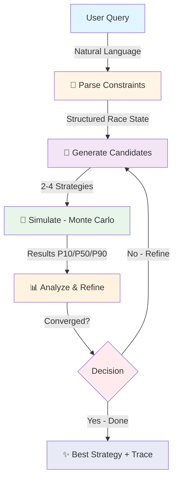

<div align="center">

# 🏎️ PitStop AI

### _AI-Powered Race Strategy Agent_

[](https://nextjs.org/)
[](https://fastapi.tiangolo.com/)
[](https://python.org/)
[](https://docker.com/)

**Powered by** [Meta Llama](https://ai.meta.com/llama/) • [Cerebras](https://cerebras.net/) • [Docker](https://docker.com/)

[🚀 Quick Start](#-quick-start) • [📖 Documentation](#-agentic-workflow) • [🎯 Demo](#-demo-guide) • [🏆 Features](#-why-this-matters)

---

</div>

## 🎯 What is PitStop AI?

**PitStop AI** is an autonomous race strategy agent that uses **iterative AI planning** to recommend optimal pit stop strategies. Ask in plain English—the agent parses your race state, generates candidates, simulates outcomes, analyzes results, and refines until convergence.

### ⚡ TL;DR

```
You: "We're 0.5s ahead at lap 8. Pit lap 12 for hards or lap 10 for mediums?"
                                  ↓
        🧠 AI Agent parses → generates strategies → simulates
                                  ↓
        📊 Iterates 2-3 times, converges to optimal solution
                                  ↓
        ✨ Result: "Pit lap 12 (hard) → +1.24s ahead by lap 18"
```

---

## 🏆 Why This Matters

| Feature                       | Description                                                                        |
| ----------------------------- | ---------------------------------------------------------------------------------- |
| 🤖 **True Agentic AI**        | Multi-stage workflow: Parse → Plan → Simulate → Analyze → Refine → Converge        |
| 🔍 **Full Transparency**      | See the agent's thinking: iterations, token usage, timings, tool arguments         |
| 📊 **Monte Carlo Simulation** | Stochastic lap times, tire degradation, pit loss with P10/P50/P90 confidence bands |
| 🎨 **Accessible UX**          | No F1 knowledge required—clear visuals and explanations for everyone               |
| ⚡ **Powered by Cerebras**    | Fast inference with Meta Llama models via OpenAI-compatible tools API              |
| 🐳 **One-Command Deploy**     | `docker compose up` and you're racing in 2 minutes                                 |

---

## 🚀 Quick Start

### Prerequisites

- 🐳 Docker & Docker Compose
- 🔑 (Optional) Cerebras API key for full agent mode

### Installation

```bash
# 1. Clone the repository
git clone https://github.com/sujal-2301/PitStop-AI.git
cd PitStop-AI

# 2. (Optional) Create .env file
cp .env.example .env
# Add your LLM_API_KEY to .env

# 3. Launch with Docker Compose
docker compose up --build
```

### Access Points

| Service             | URL                                                            | Description                               |
| ------------------- | -------------------------------------------------------------- | ----------------------------------------- |
| 🎨 **Frontend**     | [http://localhost:3000](http://localhost:3000)                 | Main UI with agent thinking visualization |
| 🔧 **API**          | [http://localhost:8000](http://localhost:8000)                 | FastAPI backend                           |
| ✅ **Health Check** | [http://localhost:8000/healthz](http://localhost:8000/healthz) | API status                                |

> **⚡ Pro Tip:** Works in mock mode without API key—full simulation, deterministic explanations!

---

## ⚙️ Configuration

Create a `.env` file in the project root:

```bash
# Frontend
FRONTEND_ORIGIN=http://localhost:3000

# LLM Configuration (Cerebras)
LLM_API_BASE=https://api.cerebras.ai/v1
LLM_API_KEY=your_cerebras_api_key_here

# Model Selection
LLM_MODEL_PLANNER=llama-4-scout-17b-16e-instruct
LLM_MODEL_EXPLAINER=llama-4-maverick-17b-128e-instruct

# Simulation API
SIM_API_URL=http://127.0.0.1:8000/run_sim
```

---

## 🎯 Demo Guide

### 3-Minute Walkthrough for Judges

```markdown
1. 📝 Input Query
   Type: "We're 0.5s ahead at lap 8. Pit lap 12 for hards or lap 10 for mediums?"

2. 🧠 Watch the Agent Think
   ├─ Parsed Constraints (lap, gap, tire state, objective)
   ├─ Iteration 1: Generated 3 strategies → simulated → analyzed
   ├─ Iteration 2: Refined 2 strategies → simulated → analyzed
   └─ Converged (top strategies within 0.1s threshold)

3. ✨ See the Results
   ├─ Agent Thinking Panel (iterations, tokens: ~1,250, time: ~3.5s)
   ├─ Recommendation: "Pit lap 12 (hard) → +1.24s ahead"
   ├─ Strategy Comparison (visual cards with progress bars)
   └─ (Optional) Detailed chart with P10/P50/P90 confidence bands

4. 🚨 Try Safety Car Mode
   Use preset "⚡ Safety Car Opportunity" to see reduced pit loss modeling
```

---

## 🤖 Agentic Workflow

<div align="center">



</div>

### 🔄 Multi-Stage Process

| Stage           | Actor                 | Description                                                    | Output                |
| --------------- | --------------------- | -------------------------------------------------------------- | --------------------- |
| 1️⃣ **Parse**    | 🧠 LLM (Planner)      | Extracts lap, gap, tire compound/age, objectives, constraints  | Structured race state |
| 2️⃣ **Generate** | 🧠 LLM (Planner)      | Proposes 2-4 strategies (undercut/overcut, soft/medium/hard)   | Candidate list        |
| 3️⃣ **Simulate** | 🎲 Monte Carlo Engine | Stochastic lap times, degradation, pit loss (400 samples)      | P10/P50/P90 gaps      |
| 4️⃣ **Analyze**  | 🧠 LLM (Planner)      | Evaluates results, proposes refinements or stops               | Continue/Converge     |
| 5️⃣ **Refine**   | 🔄 Loop               | Generates new variations, goes back to step 3                  | New candidates        |
| 6️⃣ **Converge** | ✅ Threshold          | Stops at max iterations (3) or when top strategies within 0.1s | Final recommendation  |

---

## 🏗️ Architecture

```
┌─────────────────┐
│   Next.js UI    │ ← User inputs query in plain English
│  (Port 3000)    │
└────────┬────────┘
         │ POST /plan_and_explain
         ↓
┌─────────────────┐
│   FastAPI API   │ ← Orchestrates agent workflow
│  (Port 8000)    │
└────────┬────────┘
         │
         ├─→ 🧠 Iterative Planner (LLM via Cerebras)
         │    ├─ Parse Constraints
         │    ├─ Generate Candidates
         │    ├─ Analyze & Refine
         │    └─ Loop until convergence
         │
         └─→ 🎲 Monte Carlo Simulator (sim/core.py)
              ├─ Stochastic lap times
              ├─ Tire degradation curves
              ├─ Pit loss sampling
              └─ Safety Car modeling
```

---

## 📁 Project Structure

```
PitStop-AI/
├── api/
│   ├── main.py              # FastAPI app, endpoints, CORS, health, caching
│   ├── schemas.py           # Pydantic request/response models
│   ├── Dockerfile           # API container definition
│   └── requirements.txt     # Python dependencies
├── agent/
│   ├── iterative_planner.py # 🧠 Core agent (parse → generate → refine)
│   ├── explainer.py         # Explanation generation
│   ├── llm_client.py        # Cerebras API client
│   └── config.py            # LLM configuration
├── sim/
│   └── core.py              # 🎲 Monte Carlo simulation engine
├── frontend/
│   ├── pages/
│   │   └── index.js         # Main Next.js page
│   ├── components/
│   │   ├── AgentThinking.js # Agent trace visualization
│   │   ├── ComparePanel.js  # Strategy comparison
│   │   ├── Plot.js          # Gap evolution chart
│   │   └── ExplainerCard.js # AI recommendation
│   ├── Dockerfile           # Frontend container
│   └── package.json         # Node dependencies
├── data/
│   └── synth_race.csv       # Synthetic race data
└── docker-compose.yml       # Multi-service orchestration
```

---

## 🔌 API Reference

### Endpoints

| Method | Endpoint            | Description                | Response                                                       |
| ------ | ------------------- | -------------------------- | -------------------------------------------------------------- |
| `GET`  | `/healthz`          | Health check               | `{ status: "ok", data_loaded: true }`                          |
| `POST` | `/run_sim`          | Run Monte Carlo simulation | Simulation results with P10/P50/P90                            |
| `POST` | `/plan_and_explain` | Full agent workflow        | `{ tool_args, sim_result, trace, explanation, timings, meta }` |

### Example Response

```json
{
  "tool_args": { "base_lap": 8, "base_target_gap_s": 0.5, ... },
  "sim_result": { "candidates": [...], "base_lap": 8, ... },
  "trace": {
    "thinking_steps": ["🧠 Parsing...", "✅ Constraints: {...}", ...],
    "iterations": [{ "iteration": 1, "candidates": [...], "results": [...] }],
    "total_tokens": 1250,
    "total_simulations": 5
  },
  "explanation": { "decision": "Pit lap 12 (hard)", "rationale": [...] },
  "timings": { "planner_s": 3.45, "explainer_s": 0.82, "total_s": 4.27 },
  "meta": { "provider": "Cerebras", "planner_model": "llama-4-scout-..." }
}
```

---

## 🎲 Simulation Features

### Monte Carlo Modeling

- **Stochastic Lap Times**: Gaussian noise per lap (configurable std dev)
- **Tire Degradation**: Compound-specific curves (soft/medium/hard)
  - Soft: 12 laps baseline, +0.12s/lap degradation
  - Medium: 18 laps baseline, +0.10s/lap degradation
  - Hard: 22 laps baseline, +0.08s/lap degradation
- **Pit Loss**: Sampled from N(21.0s, 0.5s) distribution
- **Confidence Bands**: P10/P50/P90 percentiles (10th, 50th, 90th)
- **Breakeven Lap**: First lap where gap returns to pre-pit level

### 🚨 Safety Car Support

| Parameter            | Type                     | Description                   | Default            |
| -------------------- | ------------------------ | ----------------------------- | ------------------ |
| `sc_window`          | `{ start_lap, end_lap }` | Laps when SC is active        | `null`             |
| `sc_pit_loss_factor` | `float`                  | Pit loss multiplier during SC | `0.6` (40% faster) |

**Example**: SC from lap 11-13 → pitting on lap 12 has 60% normal pit loss (~12.6s vs ~21s)

---

## ⚡ Performance & Reliability

| Feature                  | Implementation                          | Benefit                              |
| ------------------------ | --------------------------------------- | ------------------------------------ |
| 🗂️ **LRU Cache**         | `@lru_cache(maxsize=512)` on simulation | Avoid recomputing identical requests |
| 📊 **Data Preload**      | CSV loaded once on startup              | No per-request file I/O              |
| 🏥 **Health Checks**     | Docker healthchecks with `curl`         | Robust service orchestration         |
| ⏱️ **Timing Metrics**    | Planner/explainer/total exposed         | Transparency and debugging           |
| 🔄 **Convergence Logic** | Max 3 iterations or 0.1s threshold      | Efficient exploration                |

---

## 🎖️ Sponsor Alignment

<div align="center">

| Sponsor           | Integration                                                              | Impact                                                |
| ----------------- | ------------------------------------------------------------------------ | ----------------------------------------------------- |
| **🦙 Meta Llama** | `llama-4-scout-17b-16e-instruct`<br>`llama-4-maverick-17b-128e-instruct` | Powers all agent reasoning (parse, generate, analyze) |
| **⚡ Cerebras**   | OpenAI-compatible tools API<br>`https://api.cerebras.ai/v1`              | Fast inference for iterative planning loops           |
| **🐳 Docker**     | Multi-service compose<br>Health checks, isolated builds                  | One-command deployment, production-ready              |

</div>

---

## 🧪 Testing Locally

### Step-by-Step

1. **Open** → [http://localhost:3000](http://localhost:3000)
2. **Click** → 🏆 "Extend Lead Strategy" preset
3. **Watch** → Agent Thinking panel unfolds:
   - Parsed constraints
   - Iteration 1: 3 strategies tested
   - Iteration 2: 2 refined strategies
   - Converged at 0.08s delta
4. **Review** → Final recommendation and comparison cards
5. **Explore** → Try Safety Car preset to see SC modeling

---

## 🛠️ Troubleshooting

| Issue                            | Solution                                                           |
| -------------------------------- | ------------------------------------------------------------------ |
| ❌ "Agent modules not available" | Ensure containers built: `docker compose up --build`               |
| 🔑 "No LLM key → mock mode"      | Set `LLM_API_KEY` in `.env` for full agent; mock works without key |
| 🌐 CORS errors                   | Check `FRONTEND_ORIGIN` matches your frontend URL                  |
| 🔌 Port conflicts                | Stop services on 3000/8000 or change ports in `docker-compose.yml` |
| 🐢 Slow simulation               | Reduce `mc_samples` (default 400) or check CPU allocation          |

---

## 🗺️ Roadmap

### Future Enhancements

- [ ] **Clarifying Questions**: Ask user for missing info when inputs are ambiguous
- [ ] **Session Memory**: Remember user preferences and past strategies
- [ ] **Multi-Agent Roles**: Separate Strategist/Analyst/Risk agents with traceable outputs
- [ ] **Streaming Trace**: Real-time agent thinking updates via WebSocket
- [ ] **Advanced SC Logic**: Model VSC (virtual SC) and VSC delta
- [ ] **Historical Data**: Train degradation models on real race telemetry

---

## 📜 License

**© 2025 PitStop AI**  
Created for hackathon demonstration and judging purposes.

---

## 🙏 Acknowledgements

Built with ❤️ using:

- **[Meta Llama](https://ai.meta.com/llama/)** - Powering agentic reasoning
- **[Cerebras](https://cerebras.net/)** - Lightning-fast inference
- **[Docker](https://docker.com/)** - Seamless orchestration
- **[FastAPI](https://fastapi.tiangolo.com/)** - High-performance API framework
- **[Next.js](https://nextjs.org/)** - Modern React framework
- **[Chart.js](https://chartjs.org/)** - Beautiful data visualization

---

<div align="center">

### 🏎️ Ready to optimize your race strategy?

**[Get Started Now](#-quick-start)** | **[View Demo](#-demo-guide)** | **[Read Docs](#-agentic-workflow)**

Made with 🏁 by [Sujal](https://github.com/sujal-2301)

</div>
